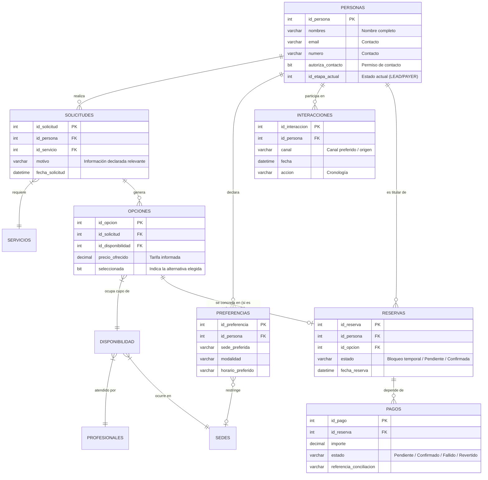

# Diagramas del Proyecto

## Diagrama E-R Específico de la Fase LEAD

Este diagrama refleja conceptualmente las entidades clave involucradas durante la fase de negociación (LEAD) y cómo se conectan con la base de datos general para lograr la transición a PAYER.

### Explicación Funcional según el Contexto
1. **Preparación de la Respuesta (Actividades 1-4)**: El sistema consulta a la entidad `PERSONAS` y su cronología en `INTERACCIONES`. Se evalúan las `PREFERENCIAS` para filtrar la `DISPONIBILIDAD` y armar las `OPCIONES` pertinentes basadas en la `SOLICITUD` actual del `SERVICIO`.
2. **Formalización del Acuerdo (Actividades 5-8)**: Se listan las `OPCIONES` (alternativas ofrecidas con precio y condiciones). Cuando el paciente confirma una explícitamente, la opción se marca como `seleccionada = true` y se genera el registro en `RESERVAS` (bloqueo temporal).
3. **Cierre y Control (Actividades 9-11)**: El área administrativa genera un registro en `PAGOS`. Solo cuando el `estado` del pago pase a "Confirmado" tras conciliación cruzada con la fuente oficial, el sistema registrará el evento de cambio de etapa y moverá la `PERSONA` de LEAD a PAYER.